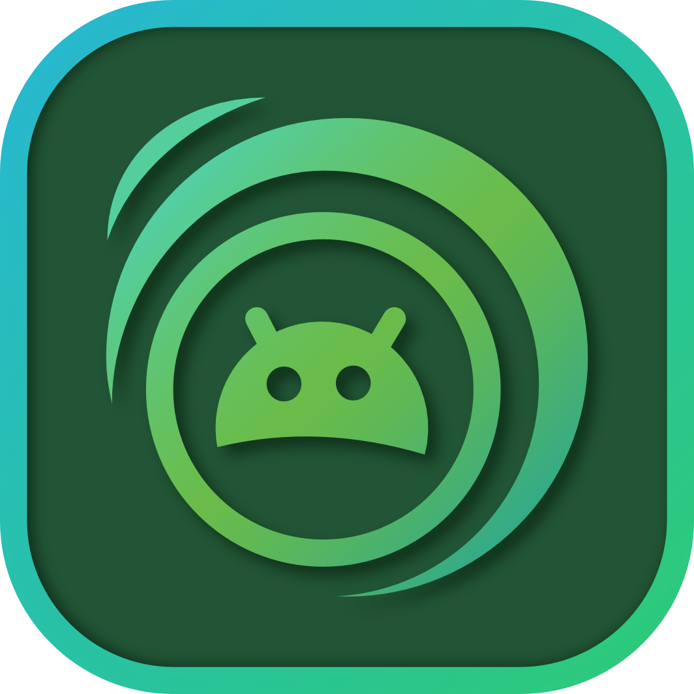

<p></p>

<p align="center"></p>

<p align="center">
    <sup><em>Your one-stop shop for everything anime on Android!</em></sup>
</p>

# Kurozora [](https://kotlinlang.org) [-white.svg?style=flat&logo=Android)]() [](https://discord.gg/f3QFzGqsah) [](LICENSE)

[Kurozora](https://kurozora.app) is your one-stop shop for everything anime!
The Kurozora Android client app gives you access to the huge catalogue of anime, manga and games. It is designed to be:

* **🏃🏻‍♂️ Responsive:** Kurozora is built with Kotlin, a **fun**, **modern**, **safe** and **interactive** programming language.

* **💻 Colossal:** The app is carefully designed to work perfectly on all screen sizes. Yes even on Samsung's Insane 292-Inch Wall TV.

* **🎨 Chameleon:** Whether black, blue, purple, or orange, it fits right with your custom theme that you spent countless hours to perfect instead of doing your work.

* **💕 Excellence:** [Kurozora API](https://github.com/kurozora/kurozora-web) and Kurozora Android are simply meant to be for each other. It’s like peanut butter and jelly, like yin and yang, like a lace in a shoe, like you're the sail of my love boat wait.. ughhh…

# Requirements

An Android device running Android

# Tools

Kurozora uses a few 3rd party tools to make development as easy and uniform as possible.

## Gradle

We use [Gradle](https://gradle.org) — an advanced build toolkit, to automate and manage the build process.

## Jetpack Compose

We use [Jetpack Compose](https://developer.android.com/jetpack/compose) for building native UI. This simplifies and accelerates UI development on Android.

# Getting Started

This is a Kotlin Multiplatform project targeting Android, Desktop (JVM).

* [/composeApp](./composeApp/src) is for code that will be shared across your Compose Multiplatform applications.
  It contains several subfolders:
    - [commonMain](./composeApp/src/commonMain/kotlin) is for code that’s common for all targets.
    - Other folders are for Kotlin code that will be compiled for only the platform indicated in the folder name.
      For example, if you want to use Apple’s CoreCrypto for the iOS part of your Kotlin app, the [iosMain](./composeApp/src/iosMain/kotlin) folder would be the right place for such calls.
      Similarly, if you want to edit the Desktop (JVM) specific part, the [jvmMain](./composeApp/src/jvmMain/kotlin) folder is the appropriate location.

### Build and Run Android Application

To build and run the development version of the Android app, use the run configuration from the run widget in your IDE’s toolbar or build it directly from the terminal:

- on macOS/Linux
  ```shell
  ./gradlew :composeApp:assembleDebug
  ```
- on Windows
  ```shell
  .\gradlew.bat :composeApp:assembleDebug
  ```

### Build and Run Desktop (JVM) Application

To build and run the development version of the desktop app, use the run configuration from the run widget in your IDE’s toolbar or run it directly from the terminal:

- on macOS/Linux
  ```shell
  ./gradlew :composeApp:run
  ```
- on Windows
  ```shell
  .\gradlew.bat :composeApp:run
  ```

# Contributing

Read our [Contributing Guide](CONTRIBUTING.md) to learn about reporting issues, contributing code, and more ways to contribute.

# Security

Read our [Security Policy](SECURITY.md) to learn about reporting security issues.

# Getting in Touch

If you have any questions or just want to say hi, join the Kurozora [Discord](https://discord.gg/f3QFzGqsah) and drop a message on the #development channel.

# Code of Conduct

This project has a [Code of Conduct](CODE_OF_CONDUCT.md). By interacting with this repository, or community you agree to abide by its terms.

# More by Kurozora

- [Kurozora Discord Bot](https://github.com/Kurozora/kurozora-discord-bot) — A versatile Discord bot with access to Kurozora services
- [Kurozora iOS App](https://github.com/Kurozora/kurozora-app) — iOS/iPadOS/MacOS client app
- [KurozoraKit (Swift)](https://github.com/Kurozora/KurozoraKit) — Simple to use framework for interacting with the Kurozora API on Apple platforms
- [KurozoraKit (Kotlin)](https://github.com/Kurozora/kurozorakit-android) — Simple to use framework for interacting with the Kurozora API on Android
- [Kurozora Linux App](https://github.com/Kurozora/kurozora-linux) — Linux client app
- [Kurozora Web](https://github.com/Kurozora/kurozora-web) — Home to the Kurozora website and API
- [Kurozora Web Extension](https://github.com/Kurozora/kurozora-extension) — Anime, Manga and Game search engine for FireFox and Chrome

# License

Kurozora Android is an Open Source project covered by
the [GNU General Public License v3.0](LICENSE).
